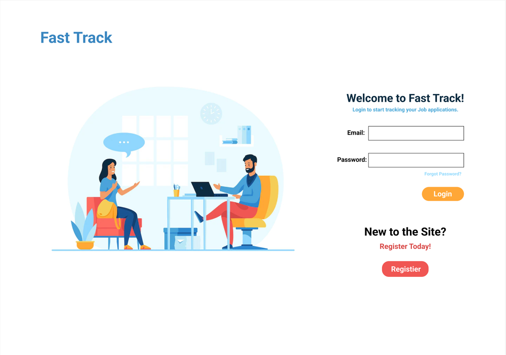

<!-- PROJECT TITLE -->

    <h1 align="center">Fast Track</h1>
    
Easily track and manage multiple job applications, allowing you to focus on your interview.

     
    

 

<!-- TABLE OF CONTENTS -->

    
Table of Contents

        <ol>
            <li><a href="#about-the-project">About the Project</a>
            <ul>
            <li><a href="#tech-stack">Tech Stack</a></li>
            </ul>
        </ol>

 
 

<!-- ABOUT THE PROJECT -->
## About the Project
 

    
     
     
    
The Fast Track application allows you to easily track and manage data for multiple job applications. Authenticated users will be directed to a homepage where they can easily track the status of applications, and easily reconnect with the contacts they have associated with those applications.

    
This fullstack application was created and deployed within a collaborative team using Github as version control. This was designed with an agile development cycle to allow for frequent updates to the team's work.

 

### Tech Stack
* Node.js
* React.js
* MYSQL
* Javascript

